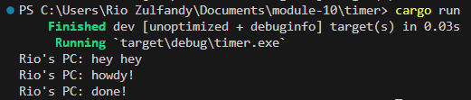
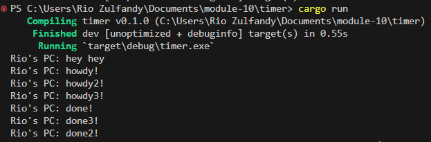
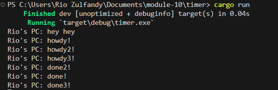
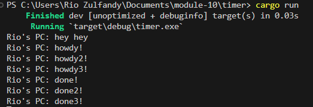

# Tutorial Timer

## 1.2 Understanding how it works

Dari pengamatan outputnya, dapat dipahami bahwa fungsi async berjalan secara independen dari fungsi utama. Akibatnya, "hey hey" berpotensi menjadi keluaran sebelum "howdy!" dan "done!" karena "hey hey" berada di luar fungsi async. Program melanjutkan untuk mengeksekusi println!("hey hey"); sedangkan fungsi async masih menunggu hasil kedepannya.

## 1.3 Multiple Spawn and removing drop

Dari keluaran yang diberikan, jelas bahwa tugas async dijalankan secara bersamaan. Urutan eksekusi dapat bervariasi karena sifat pemrograman asinkron. Dalam hal ini, "hey hey" secara konsisten dicetak terlebih dahulu karena berada di luar blok async dan dieksekusi segera setelah memunculkan tugas. Namun, urutan "howdy!" dan "done!" pesan dari setiap blok async dapat berbeda karena konkurensi. Eksekusi bersamaan memungkinkan interleaving tugas asinkron. Terkadang, satu tugas mungkin selesai sebelum tugas lainnya, sehingga menyebabkan variasi dalam urutan "howdy!" dan "done!". Perilaku ini diharapkan dalam pemrograman asinkron di mana tugas dapat berjalan secara independen dan bersamaan.